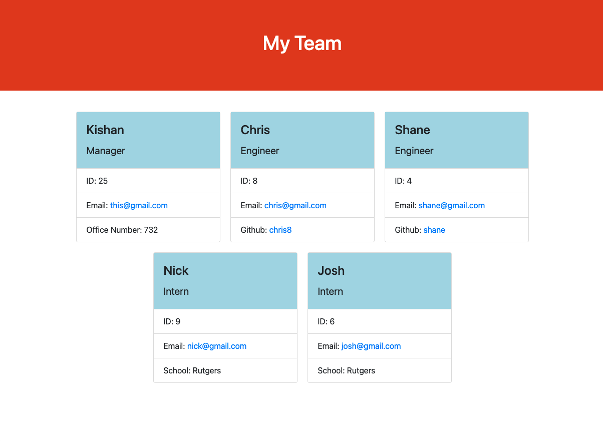

# Team Profile Generator

In this application, the user is able to input data based on questions asked by the program. First, the user will be asked about information regarding the team manager followed by questions about both the team engineers and team interns. Using this newly collected data, the program will generate a HTML document that consists of the data answered by the user into separate cards for each member of the team. Tests were also run to be sure that all aspects of the code are functioning properly.

Shown below is a screenshot of the application complete.

## Table of Contents
* [Installation](#installation)
* [Usage](#usage)
* [Contributions](#contributions)
* [Tests](#tests)
* [License](#license)
* [Questions](#questions)

## Installation
1. Open an integrated terminal
2. Run 'npm init -y'
3. Run 'npm i'
4. Run 'npm run test' to run the tests
5. Run 'node index.js' to start program

## Usage
- HTML
- CSS
- Javascript
- Node.js
- OOP
- Bootstrap

Screencastify Link Below:
[Screencastify link](https://drive.google.com/file/d/1mdh3DLPXka48osErWRS9iRHqfGbmTrLO/view)
## Tests
- By running 'npm run test', tests for each class - employee, manager, engineer, and intern can be performed.

## License
Apache

## Questions
If you have any questions, please contact me via email at [kishan725@gmail.com](mailto:kishan725@gmail.com) or through github at [kishanshah98](https://github.com/kishanshah98)
